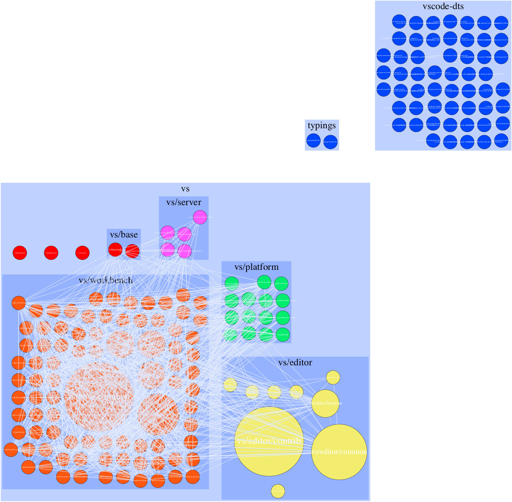
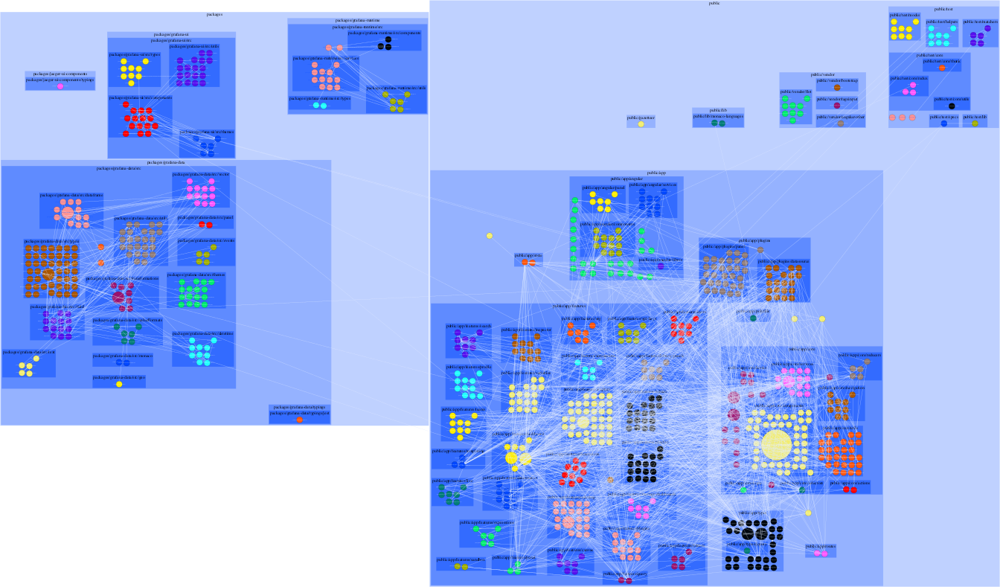

# Architecture art examples

_Visualizing cohesion and coupling_


Configuration:
```
{
  "fullName": "microsoft/vscode",
  "tsconfig": "/Users/gammon/Personal/repo-stats/.repo_cache/microsoft/vscode/src/tsconfig.json",
  "outputName": "vscode",
  "maxDepths": [
    0,
    3,
    4
  ],
  "layoutEngines": [
    {
      "name": "sfdp"
    },
    {
      "name": "fdp"
    }
  ],
  "clearCache": true
}
```


  
  
 Layout engine: sfdp 
 


  
  
 Layout engine: fdp 
 


  
  
 Layout engine: sfdp 
 


  
  
 Layout engine: fdp 
 


  
 Zoom level: 3 
 Layout engine: sfdp 
 


  
 Zoom level: 3 
 Layout engine: fdp 
 


  
 Zoom level: 3 
 Layout engine: sfdp 
 


  
 Zoom level: 3 
 Layout engine: fdp 
 




  
 Zoom level: 4 
 Layout engine: sfdp 
 


  
 Zoom level: 4 
 Layout engine: fdp 
 


  
 Zoom level: 4 
 Layout engine: sfdp 
 


  
 Zoom level: 4 
 Layout engine: fdp 
 


Configuration:
```
{
  "fullName": "angular/angular",
  "tsconfig": "/Users/gammon/Personal/repo-stats/.repo_cache/angular/angular/packages/tsconfig.json",
  "outputName": "angular",
  "maxDepths": [
    0,
    2,
    3
  ],
  "layoutEngines": [
    {
      "name": "sfdp"
    },
    {
      "name": "fdp"
    }
  ],
  "clearCache": true
}
```


  
  
 Layout engine: sfdp 
 


  
  
 Layout engine: fdp 
 


  
  
 Layout engine: sfdp 
 


  
  
 Layout engine: fdp 
 


  
 Zoom level: 2 
 Layout engine: sfdp 
 


  
 Zoom level: 2 
 Layout engine: fdp 
 


  
 Zoom level: 2 
 Layout engine: sfdp 
 


  
 Zoom level: 2 
 Layout engine: fdp 
 


  
 Zoom level: 3 
 Layout engine: sfdp 
 


  
 Zoom level: 3 
 Layout engine: fdp 
 


  
 Zoom level: 3 
 Layout engine: sfdp 
 


  
 Zoom level: 3 
 Layout engine: fdp 
 


Configuration:
```
{
  "fullName": "grafana/grafana",
  "tsconfig": "/Users/gammon/Personal/repo-stats/.repo_cache/grafana/grafana/tsconfig.json",
  "outputName": "grafana",
  "maxDepths": [
    0,
    4,
    5,
    6
  ],
  "layoutEngines": [
    {
      "name": "sfdp"
    },
    {
      "name": "fdp"
    }
  ],
  "clearCache": true
}
```


  
  
 Layout engine: sfdp 
 


  
  
 Layout engine: fdp 
 


  
  
 Layout engine: sfdp 
 


  
  
 Layout engine: fdp 
 


  
 Zoom level: 4 
 Layout engine: sfdp 
 


  
 Zoom level: 4 
 Layout engine: fdp 
 


  
 Zoom level: 4 
 Layout engine: sfdp 
 


  
 Zoom level: 4 
 Layout engine: fdp 
 


  
 Zoom level: 5 
 Layout engine: sfdp 
 


  
 Zoom level: 5 
 Layout engine: fdp 
 




  
 Zoom level: 5 
 Layout engine: sfdp 
 


  
 Zoom level: 5 
 Layout engine: fdp 
 


  
 Zoom level: 6 
 Layout engine: sfdp 
 


  
 Zoom level: 6 
 Layout engine: fdp 
 


  
 Zoom level: 6 
 Layout engine: sfdp 
 


  
 Zoom level: 6 
 Layout engine: fdp 
 


