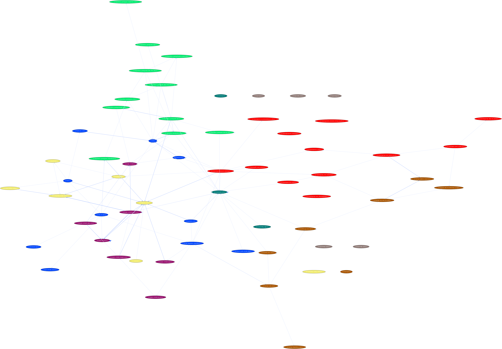
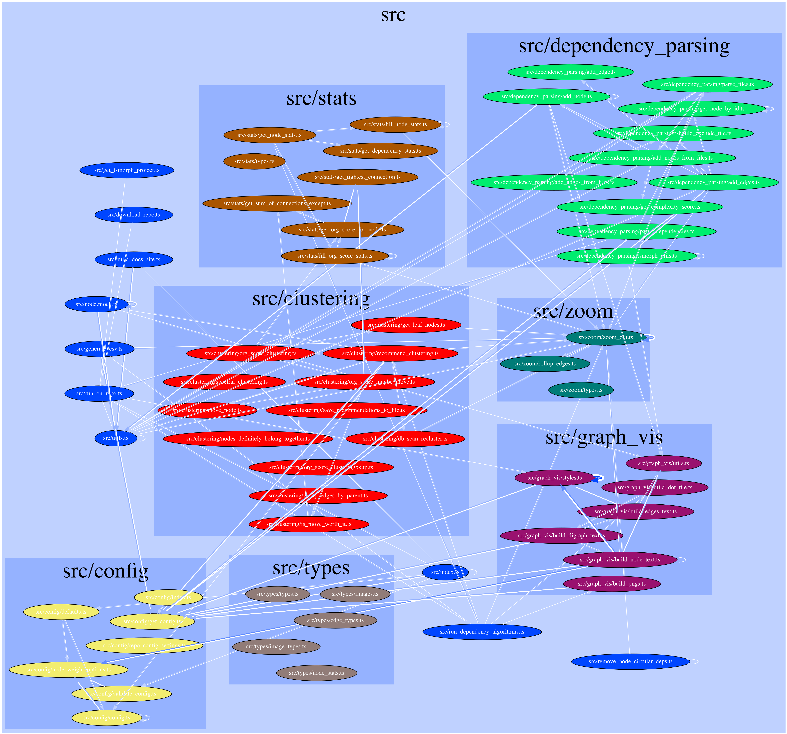
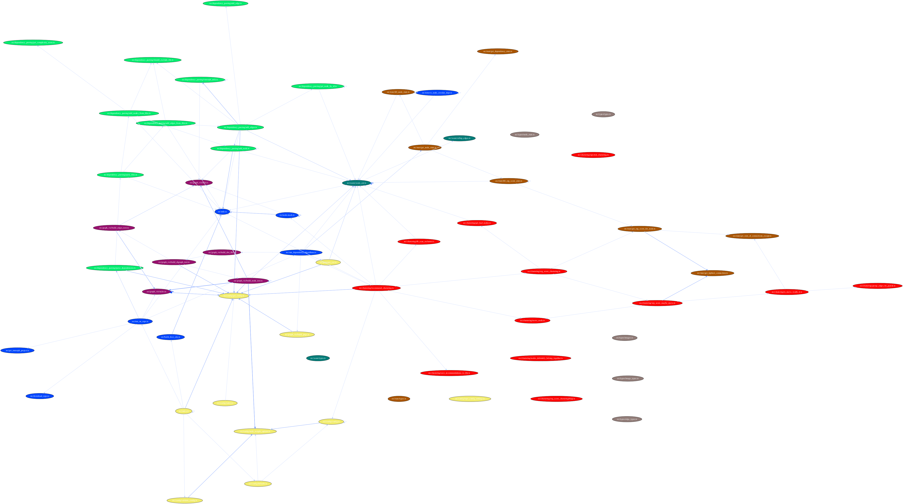
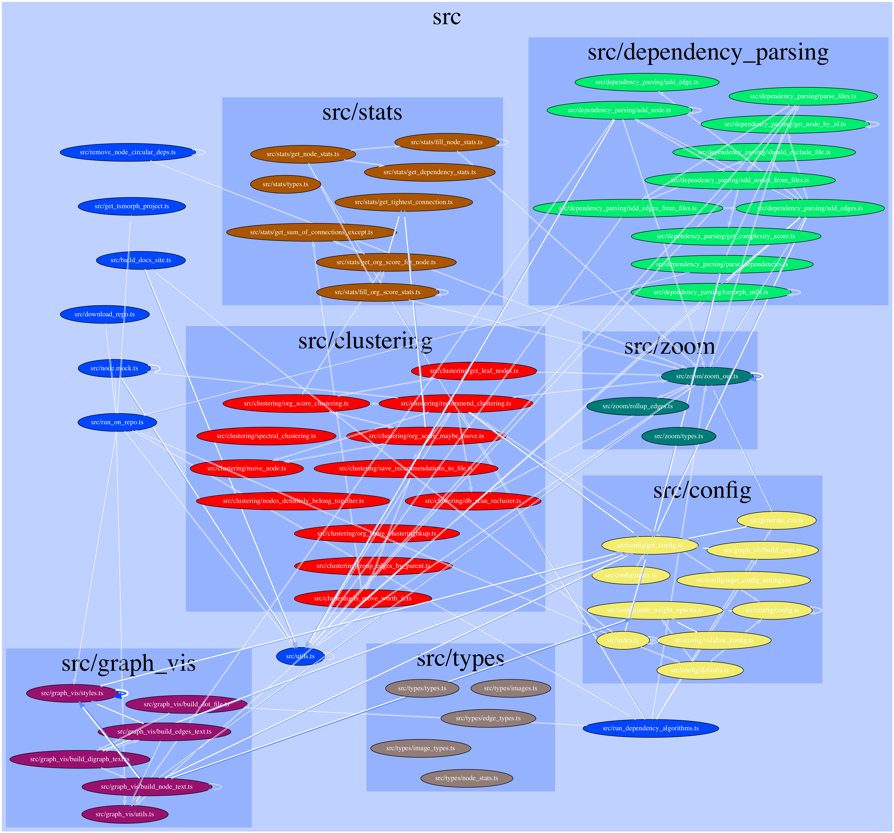

# Architecture art examples

_Visualizing cohesion and coupling_


Configuration:
```
{
  "fullName": "stacey-gammon/ts_dependency_grapher",
  "clearCache": true,
  "tsconfig": "/Users/gammon/Personal/ts_dependency_grapher/tsconfig.json",
  "source": "file",
  "zooms": [
    0
  ],
  "layoutEngines": [
    {
      "name": "sfdp"
    },
    {
      "name": "fdp"
    }
  ]
}
```


  
  
 Layout engine: sfdp 
 




  
  
 Layout engine: fdp 
 




  
  
 Layout engine: sfdp 
 




  
  
 Layout engine: fdp 
 




