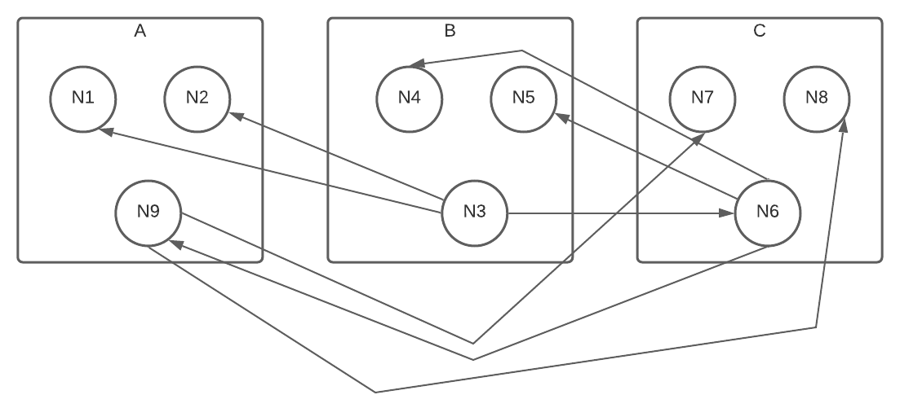

An example of poorly organized code that is tightly coupled with low to no cohesion.



This is how it shows up using the following config settings:

```
{
    "repos": [
        { 
            "full_name": "stacey-gammon/ts_dependency_grapher",
            "tsconfig": "./examples/poor_organized/tsconfig.json",
            "source": "file",
            "outputName": "poor_organized",
            "refresh": true
        }
    ],
    "outputFolder": "docs",
    "excludeFilePaths" : ["_test_", ".test.ts"],
    "maxImageSize": "14",
    "buildDocsSite": true,
    "unusedNodeColor": "white",
    "nodeColorWeight": "OrgScore",
    "nodeSizeWeight": "PublicAPICount",
    "zooms": [4],
    "clearDotCache": false,
    "refreshParsing": false
}
```